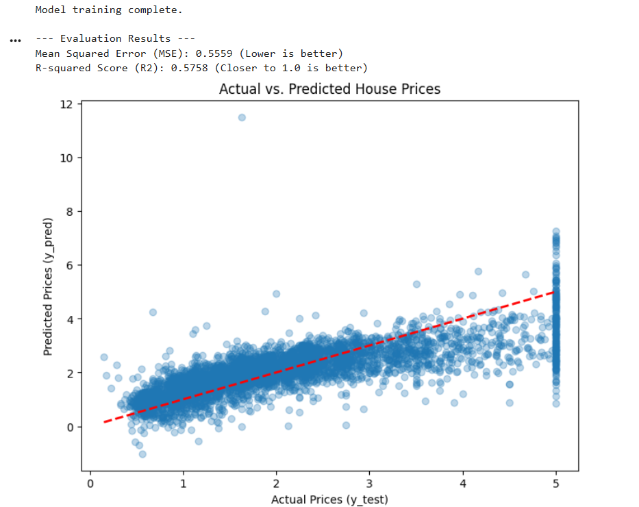

# 🏡 Task 2: House Price Prediction using Linear Regression

This project implements a simple Linear Regression model to predict median house prices using the California Housing dataset.

## 🎯 Model Details
* **Model Used:** Linear Regression
* **Dataset:** California Housing Dataset (Scikit-learn built-in)
* **Goal:** Predict the median house value (a continuous numeric value).

## 📊 Evaluation Results

The model was evaluated using standard regression metrics:
* **Mean Squared Error (MSE):** 0.5559 
    * *(Interpretation: Lower is better. Measures the average squared difference between predictions and actual values.)*
* **R-squared Score (R2):** 0.5758 
    * *(Interpretation: Closer to 1.0 is better. The model explains approximately 57.6% of the variance in house prices.)*

## 📉 Prediction Visualization

The scatter plot below compares the model's predictions against the actual house prices in the test set.

* The **Red Dashed Line** represents a perfect prediction.
* The **Blue Dots** show the performance; points close to the red line are accurate predictions.

